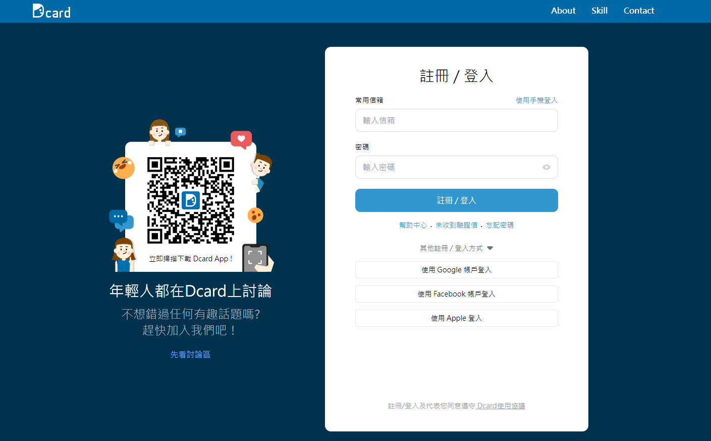
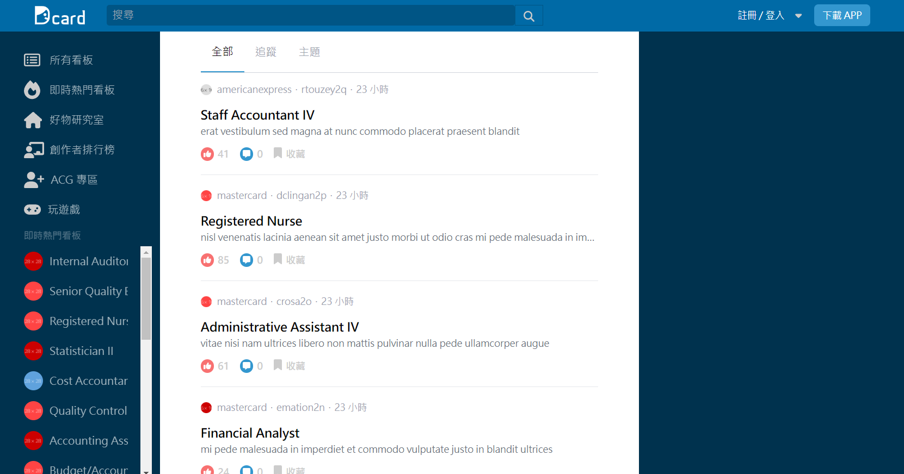

# Dcard-clone-demo
本專案用於練習前端切版和後端，參考 Dcard 登入及主頁 UI。

## 專案目的
完成 Blog 部分常用的簡易 CRUD 功能，前端版面全參考 Dcard 主頁下 Chrome 開發者模式提供的解析工具。
* Dcard Login & Main Page ( 無 RWD )
* Jwt token & LocalStorage control
* Node.js Express Restful api design ( 文章 CRUD )
* Middleware Api Auth check
* Mongodb Nosql ( 無關聯式的規劃 )

## 使用技術 / Framwork
* HTML
* Javascipt
* Tailwinds
* ES6
* Axios
* Node.js
* Express
* Mongodb

## Dcard Login Page

## Dcard Main Page

